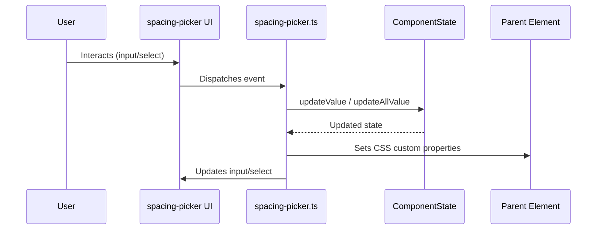

# Spacing Picker

A customizable Web Component for visually picking and applying CSS margin and padding values. Designed for easy integration into any web project, this component provides a user-friendly interface for adjusting spacing properties, making it ideal for design systems, page builders, and UI prototyping tools.

---

## ✨ Features

- **Visual margin & padding picker**  
- **Custom Element**: Use anywhere with `<spacing-picker>`
- **TypeScript & Vite powered**  
- **Zero dependencies for runtime**  
- **Small bundle size**  
- **Easy integration with any framework or vanilla JS**

---

## 📦 Installation

**npm**
```sh
npm install @sagardeep77/spacing-picker
```

Or use directly in your project by copying the files or including the built bundle.

---

## 🛠️ Usage

### 1. Import and Register the Component

```js
import 'spacing-picker/dist/main.js'; // or your build output
```

Or, if using modules:

```js
import './src/components/spacing-picker/spacing-picker';
```

### 2. Add to Your HTML

```html
<spacing-picker></spacing-picker>
```

### 3. Listen for Changes (optional)

You can listen for changes by extending the component or observing style changes on the parent element.

---

## 📁 Folder Structure

```
spacing-picker/
├── dist/                          # Production build output
├── src/
│   ├── components/
│   │   └── spacing-picker/
│   │       ├── spacing-picker.ts
│   │       ├── spacing-picker-logic.ts
│   │       ├── spacing-picker.style.css
│   │       └── spacing-picker.template.html
│   ├── constants.ts
│   ├── custom-button.ts
│   ├── custom-button.template.html
│   ├── main.ts
│   ├── style.css
│   └── utilities.ts
├── vite.config.ts
└── README.md
```

---

## 📦 Bundle Size

- **ESM build**: ~3 KB gzipped (core component only)
- **No runtime dependencies**  
- **CSS included in the component**

---

## ⚡ Dependencies

- [Vite](https://vitejs.dev/) (dev/build only)
- [TypeScript](https://www.typescriptlang.org/) (dev only)
- No runtime dependencies

---

## 🧩 API

| Property/Method | Description |
|-----------------|-------------|
| `spacing-picker` | Custom element tag. No attributes required. |
| _Events_        | None by default. Extend or observe style changes for integration. |

---

## 🗺️ Component Architecture & Data Flow

```mermaid
flowchart TD
    A[spacing-picker (Custom Element)]
    B[Shadow DOM]
    C[spacing-picker.template.html]
    D[spacing-picker.style.css]
    E[ComponentState (State Manager)]
    F[Parent Element (Styled)]
    G[User Input (UI Controls)]
    H[constants.ts]
    I[utilities.ts]

    A --> B
    B --> C
    B --> D
    B --> G
    A --> E
    E --> H
    E --> I
    G -- "input/change events" --> A
    A -- "set/remove style" --> F
    A -- "update state" --> E
    E -- "get/set values" --> A
    G -- "renders controls" --> C
```

### Data Flow

- **User Input** (inputs/selects) triggers events handled by the `spacing-picker` component.
- The component updates its **ComponentState** (state manager).
- The component applies CSS custom properties to the **Parent Element**.
- The UI is rendered using the **template** and **style** files inside the Shadow DOM.
- **constants.ts** and **utilities.ts** provide enums, types, and validation helpers.

---


---

## 📝 License

MIT

---

## 🙌 Contributing

Pull requests and issues are welcome! Please open an issue to discuss your ideas or report bugs.

---

## 🖼️ Demo


---

## 💡